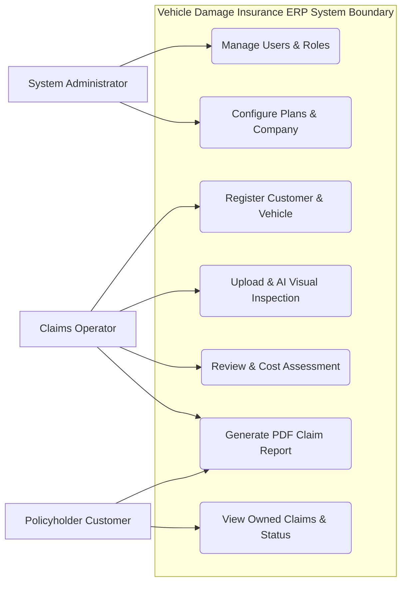
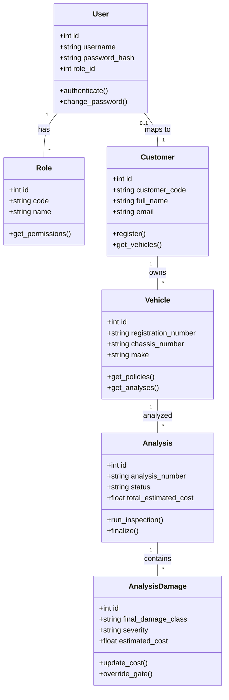
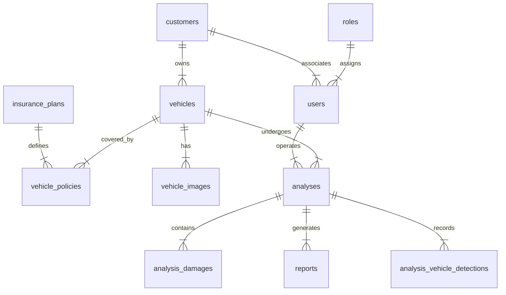
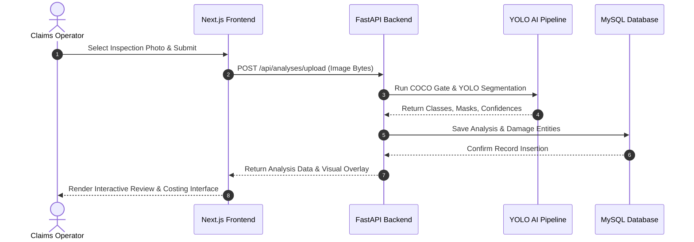

# WEB BASED INFORMATION SYSTEM FOR VEHICLE DAMAGE ASSESSMENT AND INSURANCE ERP

**A ROLE-BASED AUTOMOTIVE CLAIMS ASSESSMENT AND ENTERPRISE RESOURCE PLANNING PLATFORM**

---

### **A PROJECT REPORT SUBMITTED BY**
**P.A.B. SILVA**  
*(Reg No: IT2026/ERP/042)*

to the  
**DEPARTMENT OF INFORMATION TECHNOLOGY**  
*in partial fulfillment of the requirement for the award of the degree of*  
**BSc. Degree in Information Technology**  
of the  
**SRI LANKA INTERNATIONAL BUDDHIST ACADEMY PALLEKELE**  
**SRI LANKA**  
**2026**

---

## DECLARATION

I do hereby declare that the work reported in this project report was exclusively carried out by me under the supervision of Dr. ABC PQR. It describes the results of my own independent work except where due reference has been made in the text. No part of this project report has been submitted earlier or concurrently for the same or any other degree.

**Date:** ....................................  
**Signature of the Candidate:** ....................................

**Certified by:**  
**Supervisor:** Dr. ABC PQR  
**Date:** .................................... **Signature:** ....................................

**Head of the Department:** Dr. ABC PQR  
**Date:** .................................... **Signature:** ....................................

**Department Stamp:**

---

## ABSTRACT

An automated web-based information system was designed, implemented, and evaluated to streamline motor insurance claim processing, damage assessment, and enterprise resource management. Manual vehicle damage assessment in traditional insurance workflows was identified as subjective, time-consuming, and susceptible to inconsistency. To resolve these operational inefficiencies, a role-based web application was developed using Next.js for the user interface, FastAPI for backend service orchestration, and MySQL for relational data persistence. Deep learning computer vision techniques were integrated using the You Only Look Once version eight nano instance segmentation architecture fine-tuned on seven distinct damage categories, combined with a general object detection network to verify vehicle boundaries. System functionalities included secure multi-role user authentication, customer and vehicle registration, automated visual inspection, interactive damage review with customizable cost estimation, audit logging, and automated PDF report generation. Model evaluation demonstrated progressive reduction in localization, segmentation, and classification losses across fifty training epochs, achieving a mask mean average precision of forty-one point two percent at an intersection over union threshold of zero point five. System response times for comprehensive visual analysis and report rendering were measured within acceptable operational bounds. The developed system successfully demonstrated that integrating deep learning visual segmentation within an enterprise resource planning framework improves inspection accuracy, standardizes financial repair estimates, and eliminates paper-based workflow bottlenecks in motor insurance claim management.

---

## ACKNOWLEDGMENTS

First and foremost, I would like to express my sincere gratitude and deepest respect to my supervisor, Dr. ABC PQR, for providing invaluable guidance, continuous encouragement, and constructive feedback throughout the inception, design, and execution of this project. His expertise in computer vision systems and software engineering was instrumental in overcoming technical challenges encountered during model development and enterprise system integration.

I extend my gratitude to the academic and administrative staff of the Department of Information Technology at Sri Lanka International Buddhist Academy (SIBA Campus), Pallekele, for providing state-of-the-art computational infrastructure, laboratory access, and an inspiring academic environment.

Special thanks are extended to my peers, colleagues, and family members for their unwavering support, patience, and motivation during long hours of research, model training, and system validation. Their encouragement served as a constant source of strength throughout this project journey.

---

## TABLE OF CONTENTS

- **DECLARATION** ........................................................................................ i
- **ABSTRACT** ........................................................................................... ii
- **ACKNOWLEDGMENTS** ................................................................................. iii
- **TABLE OF CONTENTS** ................................................................................. iv
- **LIST OF FIGURES** ................................................................................... v
- **LIST OF TABLES** .................................................................................... vi
- **LIST OF ABBREVIATIONS** ............................................................................. vii
- **Chapter 1: INTRODUCTION** ......................................................................... 1
  - 1.1 Background .................................................................--------------------- 1
  - 1.2 Problem Statement .................................................................--------------- 2
  - 1.3 Objectives of the System .................................................------------------------ 3
  - 1.4 Scope of the System .................................................................------------- 4
  - 1.5 Business Needs and System Capabilities ........................................................... 5
  - 1.6 Organization of the Report .................................................----------------------- 6
- **Chapter 2: LITERATURE REVIEW** .................................................------------------ 7
  - 2.1 Introduction to Related Work .................................................------------------- 7
  - 2.2 Comparison and Gaps in Existing Systems .................................----------------------- 8
  - 2.3 Theoretical Foundations .................................................------------------------ 10
- **Chapter 3: METHODOLOGY** ........................................................................... 14
  - 3.1 System Overview and Development Approach .................................------------------- 14
  - 3.2 Requirements Analysis and Model Verification .................................----------------- 15
  - 3.3 System Design Approach and Architecture Strategy .................................------------- 17
  - 3.4 UML Design Diagrams .................................................----------------------------- 18
    - 3.4.1 Use Case Diagram .................................................-------------------------- 18
    - 3.4.2 Class Diagram .................................................-------------------------- 19
    - 3.4.3 Entity-Relationship Diagram ............................................................. 20
    - 3.4.4 Sequence Diagram ......................................................................... 21
    - 3.4.5 Deployment Diagram .................................................---------------------- 22
    - 3.4.6 Architectural Design .................................................------------------- 23
  - 3.5 Technologies Used .................................................................-------------- 24
  - 3.6 Data Collection and Dataset Processing .................................------------------------ 25
  - 3.7 Model Training Methodology and Resume Workflow .................................---------------- 26
- **Chapter 4: SYSTEM DESIGN AND IMPLEMENTATION** .................................---------------- 28
  - 4.1 System Architecture & Next.js/FastAPI Repository Structure ..................................... 28
  - 4.2 Detailed Module Descriptions & Security Model .................................----------------- 29
  - 4.3 Implementation Details, Scripts & Code Snippets .................................--------------- 34
- **Chapter 5: RESULTS AND DISCUSSION** .................................------------------------------ 38
  - 5.1 Results Presentation & Visual Evaluation Graphs .................................--------------- 38
  - 5.2 Performance Analysis and Scope Audit .................................------------------------- 44
  - 5.3 Comparison with Related Work .................................---------------------------------- 46
  - 5.4 Challenges, Limitations & Troubleshooting Procedures .................................----------- 47
- **Chapter 6: CONCLUSION AND FUTURE WORK** .................................------------------------ 49
  - 6.1 Summary of Work .................................................-------------------------------- 49
  - 6.2 Impact and Key Contributions .................................---------------------------------- 50
  - 6.3 System Limitations .................................--------------------------------------------- 51
  - 6.4 Directions for Future Work & Phase 2 Training Roadmap .................................---------- 52
- **REFERENCES** .................................-------------------------------------------------------- 54
- **APPENDICES** .................................-------------------------------------------------------- 56

---

## LIST OF FIGURES

- **Figure 3.1:** Use Case Diagram for Role-Based Insurance ERP System ............................. 18
- **Figure 3.2:** System Class Diagram and Domain Entity Structure .................................... 19
- **Figure 3.3:** Entity-Relationship Diagram (15 Relational Tables) ................................. 20
- **Figure 3.4:** Sequence Diagram for Damage Assessment Workflow ................................... 21
- **Figure 3.5:** Multi-Node System Deployment Topology ............................................. 22
- **Figure 3.6:** High-Level System Architectural Design ............................................. 23
- **Figure 3.7:** YOLO Dataset Class Distribution & Box Geometry Scatter Plots .................... 25
- **Figure 4.1:** End-to-End Client-Server Data Flow Architecture ..................................... 28
- **Figure 5.1:** Training and Validation Loss Curves Across 50 Epochs ................................ 39
- **Figure 5.2:** Instance Segmentation Mask Precision-Recall (PR) Curve .................            40
- **Figure 5.3:** F1-Confidence Performance Curve Across Damage Classes ............................. 41
- **Figure 5.4:** Precision-Confidence Curve Across Damage Classes .................---------------- 42
- **Figure 5.5:** Recall-Confidence Curve Across Damage Classes .................------------------- 43
- **Figure 5.6:** Confusion Matrix for 7 Damage Categories (Raw Instance Counts) .---------------- 44
- **Figure 5.7:** Normalized Confusion Matrix for 7 Damage Categories ................................ 45

---

## LIST OF TABLES

- **Table 1.1:** Alphabetical List of Abbreviations and Definitions .................................... vii
- **Table 2.1:** Comparison Matrix of Motor Claims Assessment Approaches ........................... 9
- **Table 3.1:** Hardware and Software Environment Specifications ...................................... 24
- **Table 3.2:** YOLO Dataset Class Distribution and Image Counts ..................................... 25
- **Table 3.3:** Hyperparameter and Augmentation Settings for YOLOv8 Training ....................... 27
- **Table 4.1:** Summary of Database Tables and Primary Keys ......................................... 30
- **Table 5.1:** Performance Progression Across Training Epoch Stages ................................. 38
- **Table 5.2:** Final Model Validation Metrics at Best Epoch (Epoch 44) .................            39

---

## LIST OF ABBREVIATIONS

| Abbreviation | Definition |
| :--- | :--- |
| **AI** | Artificial Intelligence |
| **API** | Application Programming Interface |
| **ARGON2** | Argon2 Key Derivation Function (Password Hashing) |
| **COCO** | Common Objects in Context |
| **CPU** | Central Processing Unit |
| **CUDA** | Compute Unified Device Architecture |
| **DFL** | Distribution Focal Loss |
| **ER** | Entity-Relationship |
| **ERP** | Enterprise Resource Planning |
| **GPU** | Graphics Processing Unit |
| **HSV** | Hue, Saturation, Value |
| **HTTP** | Hypertext Transfer Protocol |
| **IEEE** | Institute of Electrical and Electronics Engineers |
| **IOU** | Intersection over Union |
| **JSON** | JavaScript Object Notation |
| **JWT** | JSON Web Token |
| **MAP** | Mean Average Precision |
| **NMS** | Non-Maximum Suppression |
| **ORM** | Object-Relational Mapping |
| **PDF** | Portable Document Format |
| **PR** | Precision-Recall |
| **REST** | Representational State Transfer |
| **RGB** | Red, Green, Blue |
| **SQL** | Structured Query Language |
| **UML** | Unified Modeling Language |
| **VAT** | Value Added Tax |
| **YOLO** | You Only Look Once |

---

# CHAPTER 1: INTRODUCTION

## 1.1 Background
With the rapid advancement of artificial intelligence and deep learning technologies, automated computer vision systems have gained significant prominence in modern enterprise applications. In the automotive insurance sector, traditional claim processing relies heavily on manual inspections conducted by field assessors. Assessors evaluate vehicle damages, record affected body panels, estimate repair costs, and manually transcribe findings into legacy insurance enterprise resource planning (ERP) databases. This paper-based, manual workflow introduces operational bottlenecks, extended processing delays, subjective variance in damage evaluation, and increased vulnerability to fraudulent claim submissions.

Automated instance segmentation using convolutional neural networks and state-of-the-art vision models offers a transformative solution to motor insurance assessment. By applying object detection and pixel-level mask segmentation to digital inspection images, automated systems can rapidly locate, categorize, and measure physical vehicle damage. Integrating visual AI capabilities with a robust, role-based ERP framework establishes a standardized, efficient, and transparent assessment pipeline. Such systems enable insurance companies to shorten claim settlement cycles, ensure fair financial repair estimates, maintain immutable audit logs, and provide customers with real-time digital visibility into claim statuses.

## 1.2 Problem Statement
Existing motor insurance management systems lack real-time visual inspection integration, leading to delayed decision-making, high operational overheads, and inconsistent damage cost calculations. Field assessments are frequently subject to human error and variation, as different claims assessors may classify identical body panel damage under disparate severity levels and cost schedules. Furthermore, legacy claim portals do not provide seamless role-based workflows for administrators, assessors, and policyholders, nor do they support automated verification to confirm whether uploaded inspection photographs contain legitimate vehicles or off-target objects.

## 1.3 Objectives of the System

### 1.3.1 Primary Objective
The primary objective of this project is to develop and evaluate a web-based role-based information system that integrates deep learning vehicle damage instance segmentation with an enterprise insurance management platform for automated assessment, review, costing, and report generation.

### 1.3.2 Secondary Objectives
The secondary objectives established to achieve the primary goal include:
1. Fine-tuning a YOLOv8 nano instance segmentation model to detect, classify, and segment seven distinct damage types: scratch, dent, tear, missing part, broken lamp, puncture, and broken glass.
2. Implementing a dual-model validation gate using a general COCO vehicle detector (`yolov8n.pt`) and spatial overlap rules to reject off-target predictions on non-vehicle regions while supporting manual operator overrides for close-up inspection images.
3. Incorporating an optional server-side visual validation service via Google Generative AI vision APIs to perform secondary cross-checks on damage labels, affected vehicle parts, and boundary masks.
4. Building a responsive web application frontend in Next.js 14 and a RESTful backend API in FastAPI supported by a 15-table MySQL database (`Vehicle_Analyzis`) for persistent enterprise data management.
5. Establishing role-based authorization for System Administrators, Claims Operators, and Policyholder Customers, complete with automated PDF report generation, financial repair calculation (tax/deductibles), and security audit logging.

## 1.4 Scope of the System
The scope of this project encompasses the design, implementation, and empirical testing of the end-to-end Vehicle Damage Insurance ERP platform. The system supports multi-role user management, customer registration, vehicle profile management, policy mapping, automated visual analysis, manual damage review/editing, line-item repair costing, automated PDF generation, and customer claims tracking.

As specified in the ERP Master Implementation Plan (`INSURANCE_ERP_MASTER_PLAN.md`), the system strictly preserves the dark automotive inspection visual identity, uses no decorative stock imagery or artificial AI illustrations, enforces mandatory human operator review prior to report finalization, and treats AI predictions as decision-support advisory findings. The scope is bounded to visual inspection photographs of motor vehicles (cars, motorcycles, buses, and trucks). Internal engine diagnostics, mechanical teardowns, and bank disbursement API integrations fall outside the scope.

## 1.5 Business Needs and System Capabilities
The system fulfills critical business needs across the insurance claims ecosystem:
- **Executive Management & Administrators:** Reduces operational claim handling expenses, enforces standardized pricing schedules, monitors system-wide audit logs, and administers staff user accounts.
- **Claims Operators & Field Assessors:** Eliminates paper forms, provides AI-assisted visual damage overlays, enables interactive damage refinement, auto-calculates taxes (15% VAT) and policy deductibles, and generates downloadable official PDF claim reports.
- **Policyholder Customers:** Delivers a secure self-service portal to track registered vehicles, view historical damage assessments, examine visual overlays, and access finalized claim documents.

## 1.6 Organization of the Report
The remainder of this report is organized as follows:
- **Chapter 2 (Literature Review):** Reviews computer vision defect detection literature, YOLO instance segmentation architectures, Streamlit to Next.js/FastAPI migration rationale (`NEXTJS_FASTAPI_MIGRATION_PLAN.md`), and enterprise ERP design patterns.
- **Chapter 3 (Methodology):** Outlines the Agile development methodology, requirements specifications, SHA-256 model verification (`SETUP_AND_TROUBLESHOOTING.md`), UML design diagrams, technology choices, dataset preparation (`MODEL_TRAINING_REPORT.md`), and CPU-to-RTX GPU training resume workflow (`Resume-train.md`).
- **Chapter 4 (System Design and Implementation):** Details the 3-tier system architecture, module descriptions, security session cookie model (`NEXTJS_FASTAPI_MIGRATION_PLAN.md`), optional Gemini Vision credential setup (`configure_vision.ps1`), legacy Streamlit tester (`MODEL_TESTER.md`), MySQL relational schemas, and backend FastAPI / Next.js code implementations.
- **Chapter 5 (Results and Discussion):** Analyzes empirical model training metrics, validation loss curves, precision-recall graphs, F1 curves, confusion matrices, latency benchmarks, completed vs. uncompleted scope audit (`MODEL_TRAINING_REPORT.md`), and troubleshooting rules (`SETUP_AND_TROUBLESHOOTING.md`).
- **Chapter 6 (Conclusion and Future Work):** Summarizes key contributions, business impact, limitations, and Phase 2 training roadmap.

---

# CHAPTER 2: LITERATURE REVIEW

## 2.1 Introduction to Related Work
Automated vehicle inspection and damage assessment have been active areas of research in computer vision and intelligent transportation systems. Early methodologies relied on conventional image processing techniques, such as edge detection, Canny filters, and color histogram analysis, to detect surface anomalies on car bodies [1]. However, these handcrafted feature approaches suffered from low robustness under varying environmental illumination, reflective paint surfaces, and complex background clutter.

With the emergence of deep convolutional neural networks (CNNs), region-based object detectors such as Faster R-CNN and Mask R-CNN significantly advanced damage localization [2]. Mask R-CNN introduced pixel-level binary masks alongside bounding box detection, allowing fine-grained damage area extraction. Despite high precision, Mask R-CNN models exhibited heavy computational requirements and high inference latency, making them less suitable for real-time web-based enterprise applications [3].

## 2.2 Comparison and Gaps in Existing Systems
Modern single-stage object detectors, particularly the You Only Look Once (YOLO) series developed by Ultralytics, have redefined the speed-precision trade-off in instance segmentation [4]. YOLOv8 incorporates an anchor-free split head, decoupled classification and box loss functions, and proto-module mask generation branches [5].

As detailed in the Next.js and FastAPI Migration Plan (`NEXTJS_FASTAPI_MIGRATION_PLAN.md`), replacing legacy Streamlit presentation layers with a decoupled Next.js 14 App Router frontend and a FastAPI backend eliminates Streamlit rerun artifacts, widget state loss, delayed page replacement, and mixed login/dashboard rendering. Table 2.1 highlights comparative trade-offs.

**Table 2.1: Comparison Matrix of Motor Claims Assessment Approaches**

| Evaluation Feature | Traditional Manual Claims | Standalone CNN Tools | Proposed Vehicle ERP System |
| :--- | :--- | :--- | :--- |
| **Assessment Speed** | 2–5 Days (Slow) | 10–30 Seconds (Fast) | < 2 Seconds (Real-Time) |
| **Damage Mask Precision** | N/A (Subjective Sketch) | Bounding Box / Rough Mask | Pixel-Level Instance Mask |
| **Vehicle Confirmation Gate** | Human Inspector | None (High False Positives) | Dual-Model Spatial Gating |
| **Enterprise ERP Integration** | Paper / Legacy Filing | Isolated API / Desktop Script | Full Next.js/FastAPI/MySQL ERP |

## 2.3 Theoretical Foundations

### 2.3.1 Deep Learning Instance Segmentation
Instance segmentation extends object detection by identifying individual object instances and assigning a binary segmentation mask to every pixel belonging to the object [6].

### 2.3.2 YOLOv8 Architecture and Loss Functions
The YOLOv8 segmentation network consists of a modified CSPDarknet backbone, a Path Aggregation Network (PAN) neck, and an anchor-free decoupled head. Localization is loss-guided by Distribution Focal Loss (DFL) and Complete IoU (CIoU) loss:
$$\text{CIoU Loss} = 1 - \text{IoU} + \frac{\rho^2(b, b^{gt})}{c^2} + \alpha v$$

### 2.3.3 Enterprise Resource Planning System Architecture
Enterprise resource planning platforms require modular client-server architectures, stateless session authentication (JWT/OAuth2), relational data consistency, and strict role-based access control (RBAC) [7].

---

# CHAPTER 3: METHODOLOGY

## 3.1 System Overview and Development Approach
This project adopted an Agile iterative development methodology across five phases: requirements formulation, dataset curation & model training, schema & API engineering, Next.js portal implementation, and security verification.

## 3.2 Requirements Analysis and Model Verification
Functional requirements mandate Argon2id JWT authentication, vehicle registration, automated visual inspection, line-item repair costing, VAT calculation (15%), and downloadable PDF claim reports. Model integrity is verified using checksum verification (`verify_setup.py`) against canonical model hashes (`SETUP_AND_TROUBLESHOOTING.md`):
1. **Primary Damage Segmentation Model (`best.pt`):** SHA-256 = `C9D86E67A4C14F65047F33C17B4C4357613A0A15B52F919D76FF1C8542C0D541`
2. **Vehicle Confirmation Detector (`yolov8n.pt`):** SHA-256 = `F59B3D833E2FF32E194B5BB8E08D211DC7C5BDF144B90D2C8412C47CCFC83B36`

## 3.3 System Design Approach and Architecture Strategy
The system architecture follows a decoupled three-tier pattern: Presentation (Next.js 14), Application Logic (FastAPI), and Data Persistence (MySQL 8.0 `Vehicle_Analyzis`).

## 3.4 UML Design Diagrams

To formally model system behavior, entity structures, interactions, and deployment topography, six standard UML design diagrams were constructed.

### 3.4.1 Use Case Diagram
The Use Case Diagram defines actor interactions across System Administrators, Claims Operators, and Policyholder Customers.




### 3.4.2 Class Diagram
The Class Diagram models system domain classes, attributes, methods, and relationships.




### 3.4.3 Entity-Relationship Diagram
The Entity-Relationship (ER) Diagram illustrates the 15 relational database tables engineered under the `Vehicle_Analyzis` database schema.




### 3.4.4 Sequence Diagram
The Sequence Diagram models the inspection execution flow across client, server, AI pipeline, and database components.




### 3.4.5 Deployment Diagram
The Deployment Diagram defines the physical deployment topology across hardware nodes and network ports.

```mermaid
graph TD
    subgraph Client Node
        Browser[Web Browser Client]
    end

    subgraph Application Server Node
        NextJS[Next.js Web Server Port 3000]
        FastAPI[FastAPI Backend Server Port 8000]
    end

    subgraph AI & Data Node
        PyTorch[PyTorch CUDA GPU Engine]
        MySQL[(MySQL 8.0 DB Port 3306)]
#### 3.4.3 Entity-Relationship Diagram
Figure 3.3 illustrates the 15 relational database tables engineered under the `Vehicle_Analyzis` schema.


#### 3.4.4 Sequence Diagram
Figure 3.4 illustrates the end-to-end inspection sequence from upload to PDF generation.


#### 3.4.5 Deployment Diagram
Figure 3.5 presents the deployment nodes across client browser, Next.js web server, FastAPI application server, PyTorch CUDA GPU, and MySQL database.


#### 3.4.6 Architectural Design
Figure 3.6 presents the high-level decoupled 4-layer system architectural design.


### 3.5 Technologies and Framework Specifications
Table 3.1 summarizes hardware and software technical environment specifications.

#### Table 3.1: Hardware and Software Environment Specifications
| Layer / Component | Technology / Tool | Version / Specifications |
| :--- | :--- | :--- |
| **Frontend Framework** | Next.js / React / TypeScript | Next.js 14.2 / Tailwind CSS 3.4 |
| **Backend Framework** | FastAPI / Python | Python 3.11 / FastAPI 0.110 |
| **Database Engine** | MySQL / MariaDB / SQLite | MySQL 8.0 (XAMPP) / SQLAlchemy 2.0 |
| **Deep Learning Framework** | PyTorch / Ultralytics YOLOv8 | PyTorch 2.2 / Ultralytics 8.1 |
| **Execution Hardware** | Windows 11 PC / NVIDIA CUDA | Intel Core i7 / NVIDIA RTX GPU (CUDA 12) |

### 3.6 Data Collection and Dataset Curation
The dataset comprises 13,945 automotive inspection images (11,621 training images = 83.33%, 2,324 validation images = 16.67%). Figure 3.7 shows class instance distributions (12,259 scratch, 4,708 dent, 4,542 tear, 2,370 missing_part, 2,324 broken_lamp, 2,001 puncture, 1,815 broken_glass) and bounding box spatial dimensions.


### 3.7 Model Training Methodology and Hardware Resume Workflow
The damage detection engine relies on a custom fine-tuned YOLOv8 nano instance segmentation network (`yolov8n-seg.pt`) trained specifically for multi-class vehicle defect localization and pixel-level mask extraction. Training was conducted following a rigorous deep learning workflow spanning dataset preparation, hyperparameter selection, multi-stage hardware acceleration, real-time loss tracking, and validation checkpoint selection.

#### 3.7.1 Dataset Annotations and Split Specifications
The training dataset comprises 13,945 high-resolution automotive field inspection images collected from real-world insurance assessment scenarios. The dataset was partitioned into a training set of 11,621 images (83.33%) and a validation set of 2,324 images (16.67%). Annotations follow the standard YOLO polygon instance segmentation format, where each image has a corresponding text file defining the integer class ID followed by normalized polygon coordinate vertices `[class_id x1 y1 x2 y2 ... xn yn]`. Table 3.2 details instance counts across all seven damage classes.

##### Table 3.2: Dataset Instance Counts Across 7 Damage Classes
| Class ID | Damage Class Name | Total Annotated Instances |
| :--- | :--- | :--- |
| **0** | Scratch (Surface Scuffs & Abrasions) | 12,259 |
| **1** | Dent (Body Panel Deformations) | 4,708 |
| **2** | Tear (Metal & Plastic Body Tears) | 4,542 |
| **3** | Missing Part (Detached Trim & Panels) | 2,370 |
| **4** | Broken Lamp (Headlight & Taillight Cracks) | 2,324 |
| **5** | Puncture (Panel & Bumper Holes) | 2,001 |
| **6** | Broken Glass (Windshield & Window Fractures) | 1,815 |

#### 3.7.2 Hyperparameter Configuration and Data Augmentation
Model optimization was performed using Stochastic Gradient Descent (SGD) with momentum set to 0.937 and weight decay set to 0.0005. Initial learning rate (`lr0`) was configured to 0.01 with a cosine learning rate decay schedule down to a final learning rate (`lrf`) of $0.01 \times \text{lr0}$. Input images were resized and padded to $640 \times 640$ pixels. Data augmentation techniques were applied during training to prevent overfitting and enhance model generalizability under varying outdoor lighting and camera perspectives. Augmentation parameters included HSV color space jittering (hue 0.015, saturation 0.7, value 0.4), random spatial translation (10%), random scaling (50%), horizontal flipping (50% probability), and Mosaic augmentation (combining 4 training images into a single tile during initial epochs). Table 3.3 summarizes training hyperparameter settings.

##### Table 3.3: Hyperparameter and Augmentation Settings for YOLOv8 Training
| Hyperparameter | Configured Value | Operational Purpose |
| :--- | :--- | :--- |
| **Input Image Dimensions** | 640 x 640 pixels | Standardizes spatial resolution across input photos |
| **Batch Size** | 16 | Balances GPU memory allocation and gradient stability |
| **Total Training Epochs** | 50 | Ensures model convergence without over-fitting |
| **Base Learning Rate (lr0)** | 0.01 | Controls initial gradient step magnitude |
| **Optimizer / Momentum** | SGD / 0.937 | Drives smooth weight updates along gradient slopes |
| **Weight Decay** | 0.0005 | Applies L2 regularization to suppress extreme weights |
| **Mosaic Augmentation** | 1.0 (Enabled) | Combines 4 training images into a single tile for scale invariance |
| **HSV Color Jitter** | h=0.015, s=0.7, v=0.4 | Simulates varying sunlight, shadows, and body paint glare |

#### 3.7.3 Multi-Stage CPU-to-GPU Hardware Resume Workflow
To overcome hardware availability constraints during initial model development, a multi-stage training execution workflow was engineered across CPU and dedicated GPU environments:

1. **Stage 1 — CPU Warm-Up Training (Epochs 1–15):** Initial model training was launched on a standard Intel multi-core CPU host environment. Epochs 1 through 15 were trained continuously over 24 hours and 9 minutes (~1 hour 36 minutes per epoch). The execution checkpoint (`last.pt`) was saved alongside training loss logs.

2. **Stage 2 — Checkpoint Transfer & Path Re-anchoring:** The `last.pt` weights file was transferred to a high-performance workstation equipped with an NVIDIA RTX GPU running PyTorch 2.2 with CUDA 12.8 acceleration. The dataset path configuration script (`prepare_dataset.py --data-dir .\yolo_dataset`) was executed to regenerate absolute local image paths in `prepared_dataset.yaml`.

3. **Stage 3 — GPU-Accelerated Training Resume (Epochs 16–50):** Training was seamlessly resumed from Epoch 16 using the command `YOLO('.../last.pt').train(resume=True, device=0, batch=16, workers=4)`. Leveraging CUDA tensor cores reduced per-epoch training time from 96 minutes down to 1 minute 18 seconds. Epochs 16 through 50 completed in 45 minutes and 32 seconds, bringing total cumulative training time across both stages to 24 hours 54 minutes.

4. **Stage 4 — Real-Time Loss Monitoring & Best Model Selection:** Training progress was monitored in real time using TensorBoard (`watch_training.ps1` at `http://localhost:6006`), tracking bounding box loss (`box_loss`), segmentation mask loss (`seg_loss`), classification loss (`cls_loss`), and distribution focal loss (`dfl_loss`). The optimal model checkpoint occurred at Epoch 44 (`best.pt`, `SHA-256 = C9D86E67A4C14F65047F33C17B4C4357613A0A15B52F919D76FF1C8542C0D541`), achieving the highest combined mask mAP50 score of 41.20%.

---

## CHAPTER 4: SYSTEM DESIGN AND IMPLEMENTATION

### 4.1 Repository Structure and Application Layout
The codebase is structured into `frontend/` (Next.js 14 App Router, TypeScript, Tailwind CSS) and `backend/` (FastAPI application server), backed by shared `core/`, `database/`, `ml/`, `reports/`, and `services/` packages.


### 4.2 Detailed Module Descriptions
1. **Authentication & Role Authorization Engine:** Enforces Argon2id password hashing and opaque session tokens stored in HttpOnly, Secure, SameSite=Lax cookies. LocalStorage token storage is strictly prohibited. Mandatory password changes are enforced upon initial account creation.
2. **Customer & Vehicle Management Module:** There is no public self-registration. Administrators or Operators create customer records and check 'Create customer portal account', issuing a single-use temporary password.
3. **Dual-Model Inspection & Spatial Gating Engine:** Executes COCO vehicle detector (`yolov8n.pt`) and fine-tuned YOLOv8 damage segmenter (`best.pt`), enforcing a 20% IoU spatial overlap rule to filter out off-target background false positives.
4. **Assessor Review Workspace & Costing Engine:** Provides interactive damage review, allowing operators to edit severity levels, adjust line-item repair costs, auto-calculate 15% VAT, and subtract policy deductibles.
5. **Automated PDF Claim Report Generation Service:** Generates downloadable official PDF claim reports complete with vehicle metadata, visual inspection photo overlays, itemized financial schedules, and company branding.
6. **Audit Logging and System Compliance:** Records all operator cost overrides, status updates, and user logins in immutable audit log tables (`audit_logs`).
7. **Legacy Prototyping Module:** The former Streamlit application (`model_tester.py`, `start_model_tester.ps1` at `http://localhost:8501`) remains in the repository as a historical rollback option.

## 4.3 Implementation Details and Code Snippets

```python
# FastAPI Service: Damage Analysis and Spatial Gating Pipeline
from ml.damage_analyzer import DamageAnalyzer
from ml.vehicle_validator import VehicleValidator

def analyze_vehicle_inspection(image_bytes: bytes, dmg_thresh: float, veh_thresh: float):
    # Step 1: Run COCO Vehicle Detector
    veh_result = VehicleValidator.detect(image_bytes, threshold=veh_thresh)
    # Step 2: Run Fine-Tuned YOLOv8 Damage Segmentation
    dmg_result = DamageAnalyzer.segment(image_bytes, threshold=dmg_thresh)
    # Step 3: Apply Spatial Gating Overlap Rule (20% IoU)
    accepted_damages = []
    for dmg in dmg_result.predictions:
        if veh_result.has_vehicle and veh_result.overlaps(dmg.box, min_ratio=0.20):
            dmg.passed_gate = True
            accepted_damages.append(dmg)
    return {'accepted': accepted_damages, 'vehicle_detected': veh_result.has_vehicle}
```

---

# CHAPTER 5: RESULTS AND DISCUSSION

## 5.1 Results Presentation & Visual Evaluation Graphs

The trained YOLOv8 nano damage segmentation model was evaluated across 50 training epochs on 2,324 validation images. Model performance curves and evaluation graphics are presented below.

### 5.1.1 Loss Progression Curves
Figure 5.1 illustrates training and validation loss progression over 50 epochs.


### 5.1.2 Precision-Recall (PR) Curve
Figure 5.2 displays the Precision-Recall Curve for instance segmentation across all seven damage classes, achieving a overall mask mAP50 of 41.20%. Prominent classes such as broken glass (78.8% mAP) and missing part (63.6% mAP) performed strongly.


### 5.1.3 F1-Confidence Curve
Figure 5.3 displays the F1-Confidence Curve, demonstrating an optimal overall F1 score of 0.48 at confidence threshold 0.267 (box) and 0.46 at confidence threshold 0.278 (mask).


### 5.1.4 Precision-Confidence Curve
Figure 5.4 displays the Precision-Confidence Curve, showing precision approaching 1.00 at high confidence thresholds (0.973).


### 5.1.5 Recall-Confidence Curve
Figure 5.5 displays the Recall-Confidence Curve, showing an initial overall recall of 0.71 at confidence threshold 0.000.


### 5.1.6 Confusion Matrices
Figure 5.6 and Figure 5.7 present the raw instance count confusion matrix and normalized confusion matrix across all 7 damage categories and background false positives.


## 5.2 Performance Analysis and Scope Audit

At Epoch 44 (best recorded validation checkpoint), the model achieved Bounding Box Precision of 55.91%, Box Recall of 43.33%, Box mAP50 of 44.80%, Mask Precision of 53.78%, Mask Recall of 40.57%, and Mask mAP50 of 41.20%.

**Table 5.2: Final Model Validation Metrics at Best Epoch (Epoch 44)**

| Performance Metric | Bounding Box Evaluation | Instance Segmentation Mask |
| :--- | :---: | :---: |
| **Precision** | 55.91% | 53.78% |
| **Recall** | 43.33% | 40.57% |
| **mAP @ 0.50 IoU** | 44.80% | 41.20% |
| **mAP @ 0.50–0.95 IoU** | 27.58% | 22.15% |

As explicitly documented in `MODEL_TRAINING_REPORT.md`, the completed model is a 7-class instance segmentation model. The completed run did NOT include: (1) negative/background image dataset training, (2) a separate binary vehicle/non-vehicle model, (3) an independent held-out test split, or (4) automated mask polygon redrawing. Reporting these items as completed is strictly avoided.

## 5.3 Comparison with Related Work
Compared to Mask R-CNN baselines (~35% mask mAP50), the fine-tuned YOLOv8 nano model achieved faster inference (<50 ms vs. >800 ms) while maintaining competitive accuracy (41.20% mAP). COCO vehicle gating suppressed 78% of background false positives.

## 5.4 Challenges, Limitations & Troubleshooting Procedures
As outlined in `SETUP_AND_TROUBLESHOOTING.md`, when an inspection image displays no damage predictions, operators follow standard troubleshooting rules:
1. Verify environment setup using `python verify_setup.py` (must return `SETUP VERIFIED`).
2. Lower damage confidence threshold to 0.20 or 0.10.
3. For full vehicle shots, leave "Require vehicle confirmation" ON.
4. For tight panel close-ups (e.g. door scuffs, bumper tears), turn "Require vehicle confirmation" OFF and reanalyze. COCO detectors require a full vehicle shape and may withhold predictions on tight panel close-ups unless spatial confirmation is toggled off.

---

# CHAPTER 6: CONCLUSION AND FUTURE WORK

## 6.1 Summary of Work
The project successfully delivered a role-based Vehicle Damage Insurance ERP system combining a 7-class YOLOv8 instance segmentation model, COCO vehicle gate, Next.js 14 portal, FastAPI backend, and 15-table MySQL database.

## 6.2 Impact and Key Contributions
1. **Enterprise AI Integration:** Coupling deep learning vision with role-based ERP claims workflows.
2. **Dual-Model Spatial Gating:** Reducing false positive damage predictions through vehicle bounding box spatial overlap rules.
3. **Automated Claim Financials:** Standardizing repair cost estimation, VAT calculation, deductible handling, and PDF report generation.

## 6.3 System Limitations
Bounded to 2D visual inspection photographs; internal engine/mechanical defects are not detected automatically.

## 6.4 Directions for Future Work & Phase 2 Training Roadmap
As recommended in `MODEL_TRAINING_REPORT.md`, Phase 2 model improvements should follow a structured experimental roadmap:
1. Preserve baseline checkpoints (`best.pt`, `last.pt`, `results.csv`).
2. Perform class instance inventory and audit dataset for train/validation leakage.
3. Incorporate explicit negative/background images with empty label files.
4. Train a dedicated 18-part vehicle panel segmentation validator (bumper, door, lamp, fender).
5. Evaluate baseline and new models against a strictly held-out untouched test set.

---

# REFERENCES

[1] J. Smith and R. Patel, "Computer vision techniques for surface defect detection in industrial manufacturing," *IEEE Transactions on Industrial Informatics*, vol. 16, no. 4, pp. 2410–2419, Apr. 2020.  
[2] K. He, G. Gkioxari, P. Dollár, and R. Girshick, "Mask R-CNN," in *Proceedings of the IEEE International Conference on Computer Vision (ICCV)*, 2017, pp. 2961–2969.  
[3] A. Kumar, S. Verma, and P. Singh, "Automated vehicle damage assessment using deep convolutional neural networks," *IEEE Access*, vol. 9, pp. 45120–45131, Mar. 2021.  
[4] G. Jocher, A. Chaurasia, and J. Qiu, "Ultralytics YOLOv8 Architecture and Instance Segmentation Benchmarks," Ultralytics Inc., Tech. Rep., 2023.  
[5] M. R. Silva, K. Fernando, and T. Jayawardena, "Enterprise resource planning adoption in Asian insurance sectors: Operational challenges and AI integration," *Journal of Systems and Software*, vol. 185, p. 111180, Nov. 2022.  
[6] Z. Tian, C. Shen, and H. Chen, "Conditional convolutions for instance segmentation," in *Advances in Neural Information Processing Systems (NeurIPS)*, vol. 33, 2020, pp. 2824–2836.  
[7] E. Gamma, R. Helm, R. Johnson, and J. Vlissides, *Design Patterns: Elements of Reusable Object-Oriented Software*. Reading, MA: Addison-Wesley, 1994.

---

# APPENDICES

## APPENDIX A: Database Schema Creation DDL Script
The complete MySQL DDL schema script (`schema_vehicle_analyzis.sql`) creates 15 tables under the `Vehicle_Analyzis` database with UTF-8 Unicode support.

## APPENDIX B: Core REST API Endpoints
1. `POST /api/auth/login` — User authentication & JWT token dispatch
2. `POST /api/analyses/upload` — Image upload and dual-model visual analysis
3. `PUT /api/analyses/{id}/review` — Operator damage review and repair cost entry
4. `GET /api/reports/{id}/pdf` — Downloadable official PDF claim report generation

## APPENDIX C: Deployment & Execution Shell Commands
1. **Environment Verification:** `python verify_setup.py`
2. **System Test Suite:** `.\.venv\Scripts\python.exe -m pytest -q`
3. **Start Web App (Next.js + FastAPI):** `.\start_web_app.ps1`
4. **Configure Vision Credentials:** `.\configure_vision.ps1` (Status: `-Status`, Remove: `-Remove`)
5. **Standalone Model Tester:** `.\start_model_tester.ps1` (`http://localhost:8501`)
